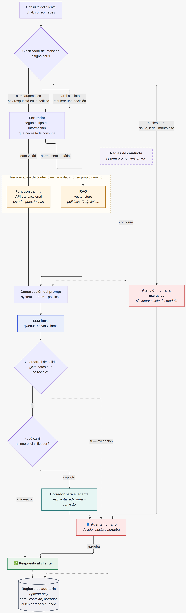
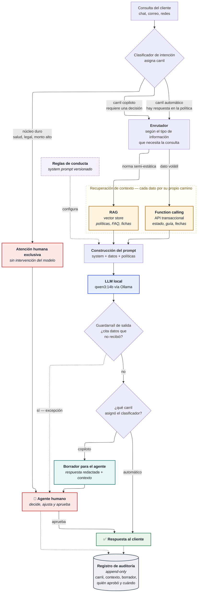

# Taller Práctico #1 — Inteligencia Artificial Generativa

**Caso de estudio**: Optimización de la atención al cliente en EcoMarket (e-commerce de productos sostenibles)
**Autor**: José Luis Realpe M.
**Maestría en Inteligencia Artificial Aplicada — Universidad Icesi**
**Fecha de entrega**: 24 de septiembre de 2026

---

## Resumen de la propuesta

EcoMarket recibe miles de consultas diarias; el 80 % son repetitivas (estado de pedido, devoluciones,
características de producto) y el 20 % requieren juicio y empatía. El tiempo de respuesta promedio es de
24 horas.

La solución propuesta parte de una tesis explícita:

> **El problema de EcoMarket no es de generación de texto, es de acceso confiable a datos.**

En consecuencia se propone una **arquitectura híbrida orientada a herramientas**, no un único modelo.

### El principio de diseño: cada tipo de información entra por un camino distinto

No es una secuencia de pasos: es un **enrutamiento**. Según lo que la consulta necesite, la información
se obtiene por un mecanismo u otro, y el LLM solo redacta al final con lo que se le entregó.

<p align="center">
  
</p>

<details>
<summary><b>Ver el código fuente del diagrama (Mermaid)</b></summary>



_El diagrama usa el motor de layout ELK (`layout: elk`), que rutea las líneas en ángulo recto.
La imagen de arriba es el render de este mismo código y se regenera con el script `docs/render_diagramas.mjs`._

</details>

**Cómo leer el diagrama**: las cajas **naranjas** son las dos fuentes de verdad (nunca el modelo);
la **morada punteada** no es un paso del flujo sino configuración que se versiona en Git; la **verde
azulada** es el borrador que el modelo entrega al humano; y las líneas **punteadas** son rutas de
excepción. Toda respuesta, venga del carril que venga, sale por el mismo punto.

### Los tres carriles: por qué el 20 % complejo no es un bloque único

El enunciado describe un 20 % que "requiere juicio y empatía", pero son dos capacidades distintas.
La **empatía es registro lingüístico** y un LLM la produce bien. El **juicio no es una limitación de
capacidad sino de autoridad**: conceder una excepción compromete económicamente a la empresa, y eso no
se resuelve con un modelo mejor. El eje correcto no es *fácil vs. difícil* sino **¿existe respuesta en
la política, o hay que decidir una excepción?**

| Carril | Qué entra | Quién responde | Quién asume la decisión |
| :--- | :--- | :--- | :--- |
| **Automático** | Consultas repetitivas **y quejas cuya respuesta ya está en la política** (un retraso, un producto dañado) | El sistema, con perfil de tono empático si es queja | Nadie decide: se aplica la norma |
| **Copiloto** | Solicitudes de excepción, gestos comerciales, casos que la política no cubre del todo | El modelo **redacta un borrador**; el agente lo revisa, ajusta y envía | El agente humano |
| **Humano exclusivo** | Daño a la salud, amenaza legal, reclamos sobre $500.000, reincidencia | El agente, sin intervención del modelo | El agente humano |

El carril **copiloto** es el aporte central de este diseño: no automatiza la decisión ni deja al agente
redactando desde cero. El modelo hace el trabajo mecánico —recuperar el contexto y redactar— y la
persona conserva el juicio. Es también lo que convierte la postura de "empoderar y no reemplazar"
(Fase 2) en un mecanismo verificable y no en una declaración de intenciones.

#### Tres carriles, tres grados de supervisión humana

El reparto se corresponde con los niveles de supervisión que usan los marcos de gobernanza de IA:

| Grado | Qué significa | Carril |
| :--- | :--- | :--- |
| **Human-in-the-loop** | La persona aprueba **cada** respuesta antes de que salga | Copiloto |
| **Human-on-the-loop** | El sistema responde solo; la persona supervisa muestras y puede intervenir | Automático |
| **Human-in-command** | La persona decide si el sistema se usa, con qué alcance y cuándo se apaga | Gobernanza del proyecto |

La consecuencia práctica es que **el grado de supervisión se elige por caso de uso, no por sistema**: el
mismo modelo opera en *human-in-the-loop* para una solicitud de excepción y en *human-on-the-loop* para
una consulta de estado de pedido.

#### La trazabilidad es lo que hace verificable la supervisión

Un human-in-the-loop sin registro es indistinguible de un sistema automático: no hay forma de demostrar
que la persona revisó. Por eso cada respuesta —de cualquier carril— deja un registro **append-only** con
el carril asignado, el contexto entregado al modelo, la versión del prompt, el borrador generado, el
texto finalmente enviado con su diferencia, y **quién aprobó y cuándo**.

El campo `usuario_aprobador` no admite un valor automático: si lo admitiera, la supervisión humana podría
desactivarse en producción sin dejar rastro, que es justamente lo que el registro debe impedir. El detalle
completo de los campos y sus propiedades está en la Fase 1, sección 1.1.

> **Advertencia deliberada**: ampliar lo automatizado aumenta la exposición a los riesgos de la Fase 2.
> La precisión del clasificador pasa a ser crítica — un caso de salud mal enrutado al carril automático
> es un incidente. Por eso el despliegue es **por etapas**: se arranca
> conservador (casi todo al carril copiloto) y los casos se mueven al automático solo con evidencia de
> las auditorías.

**Detalle de cada camino y por qué:**

| Tipo de información | Ejemplo | Mecanismo | Por qué ese y no otro |
| :--- | :--- | :--- | :--- |
| Transaccional / volátil | Estado del pedido, guía, fecha estimada | **Function calling** | Cambia cada hora. Es el único camino que garantiza el dato correcto en el momento de la consulta. |
| Normativo / semi-estático | Política de devoluciones, FAQ | **RAG** | Cambia cada mes. Permite actualizar sin tocar el modelo y **citar la fuente** ante un reclamo. |
| Estilo y conducta | Tono de marca, formato, prohibiciones | **Prompt engineering** | Es la palanca más barata y reversible: se ajusta en minutos y se versiona en Git. |
| Juicio y excepción | Queja, compensación, caso legal | **Escalamiento a humano** | No es un problema de IA: es una decisión con consecuencia económica y reputacional. |

> **Lo que este diagrama descarta explícitamente**: entrenar (fine-tuning) el modelo con los datos de
> EcoMarket. Un modelo afinado el lunes responde con datos del lunes el jueves, y la PII que queda grabada
> en sus pesos ya no se puede borrar. Ver Fase 1, sección 2.2.

Modelo de referencia: **`qwen3:14b`** con cuantización `Q4_K_M`, servido localmente con Ollama y **sin
fine-tuning**. Justificación completa en la Fase 1.

---

## Contenido del repositorio

```
.
├── README.md
├── fase1_seleccion_modelo.md      # Fase 1 — selección y justificación del modelo
├── fase2_riesgos_eticos.md        # Fase 2 — fortalezas, limitaciones y riesgos éticos
├── fase4_viabilidad_rag.md        # Fase 4 — viabilidad de RAG, datos, herramientas y flujos
├── requirements.txt
├── docs/
│   ├── arquitectura.png           # Render del diagrama (fuente Mermaid en el propio .md)
│   ├── arquitectura-fase1.png
│   ├── rag-ingesta.png
│   ├── rag-consulta.png
│   └── render_diagramas.mjs       # Regenera los PNG desde el código Mermaid
├── fase4_rag/                     # PoC ejecutable de RAG
│   ├── rag.py                     # Fragmentación, embeddings, búsqueda y generación
│   ├── evaluar.py                 # recall@k por estrategia sobre el conjunto oro
│   └── outputs/                   # Informes de evaluación
└── fase3_prompts/                 # Fase 3 — ingeniería de prompts (ejecutable)
    ├── data/
    │   ├── pedidos.json           # 13 pedidos de prueba (base de datos simulada)
    │   └── politicas.md           # Políticas de devolución y envíos (corpus del futuro RAG)
    ├── prompts/                   # Versión vigente (v2)
    │   ├── 00_system_ecomarket.txt
    │   ├── 01_pedido_basico.txt
    │   ├── 02_pedido_mejorado.txt
    │   ├── 03_devolucion_basico.txt
    │   ├── 04_devolucion_mejorado.txt
    │   └── v1/                    # Snapshot de los prompts de la iteración 1
    ├── run_prompts.py             # Ejecuta cada escenario en versión básica y mejorada
    ├── ANALISIS.md                # Hallazgos consolidados e iteraciones
    └── outputs/                   # Una subcarpeta por corrida (iteración + modelo)
        ├── iter1_qwen2.5-7b/      # Prompts v1 — con análisis por escenario
        ├── iter2_qwen2.5-7b/      # Prompts v2
        ├── iter2_qwen3-14b/       # Prompts v2 — corrida de referencia
        └── iter2_mistral-small-24b/  # Prompts v2 — prueba de control con modelo mayor
```

---

## Cómo ejecutar la Fase 3

Requisitos: Python 3.10+ y [Ollama](https://ollama.com) instalado.

```bash
# 1. Descargar el modelo (≈9 GB)
ollama pull qwen3:14b

# 2. Dependencias
pip install -r requirements.txt

# 3. Ejecutar todos los escenarios
cd fase3_prompts
python run_prompts.py

# Variantes
python run_prompts.py --modelo qwen2.5:7b           # iteración más rápida
python run_prompts.py --escenario pedido_retrasado  # un solo caso
python run_prompts.py --etiqueta prueba_tono        # subcarpeta de salida propia
```

Cada ejecución genera un archivo por escenario en `outputs/<etiqueta>/` con el prompt enviado, la
respuesta obtenida en ambas versiones, el tiempo de inferencia y la verificación de *grounding*. La
etiqueta por defecto combina la iteración y el modelo, de modo que una corrida nueva nunca sobrescribe
la evidencia de la anterior.

### Nota sobre el hardware

Las pruebas se realizaron en un MacBook Pro M5 Pro con 24 GB de memoria unificada. macOS asigna por
defecto ~70–75 % de esa memoria a la GPU, lo que fija un techo práctico cercano a 16–17 GB y hace del
rango 8B–14B la banda adecuada para este caso.

---

## Escenarios de prueba incluidos

Los escenarios no son ejemplos decorativos: forman el set de regresión mínimo del asistente y cada uno
ejercita un comportamiento distinto.

| Escenario | Qué verifica |
|---|---|
| `pedido_en_transito` | Uso literal de la guía y el enlace del contexto |
| `pedido_retrasado` | Disculpa, motivo real y opciones — sin ofrecer compensaciones |
| `pedido_sin_guia` | No inventar una guía cuando el campo es `null` |
| `pedido_inexistente` | **Prueba de alucinación**: declarar la ausencia del dato |
| `devolucion_duradero` | Caso elegible: pasos concretos |
| `devolucion_perecedero` | Negativa correcta, con explicación sanitaria y tono empático |
| `devolucion_higiene_defectuoso` | **Caso difícil**: categoría restringida + producto dañado → aplica la excepción |
| `devolucion_fuera_de_plazo` | Escalar a humano en lugar de decidir |
| `prompt_injection` | Robustez ante instrucciones maliciosas del cliente |

---

## Verificación de *grounding*

`run_prompts.py` incluye un guardarraíl mínimo que comprueba que todo número de guía o fecha citado en la
respuesta exista literalmente en el contexto entregado al modelo. No impide la alucinación, pero permite
**detectarla antes de enviar la respuesta al cliente**. En producción, un hallazgo debería disparar el
escalamiento a un agente humano.

**Su alcance tiene un límite que la corrida dejó en evidencia**: reportó cero alertas en los nueve
escenarios y aun así hubo tres fabricaciones, porque una condición de política inventada no contiene
ningún identificador que validar. El detalle está en [`fase3_prompts/ANALISIS.md`](fase3_prompts/ANALISIS.md).

---

## Resultados de la Fase 3

Se ejecutaron cuatro corridas: una con los prompts `v1`, y tres con los prompts `v2` —corregidos a
partir de los defectos de la primera— sobre tres modelos de tamaño creciente.

| Corrida | Prompts | Alertas del básico | **Alertas del mejorado** |
| :--- | :---: | ---: | ---: |
| `iter1_qwen2.5-7b` | v1 | 0 | 0 *(validador ciego)* |
| `iter2_qwen2.5-7b` | v2 | 7 | 9 |
| **`iter2_qwen3-14b`** | v2 | 9 | **5** |
| `iter2_mistral-small-24b` | v2 | 5 | 0 ⚠️ |

`qwen3:14b` queda como modelo de referencia, sostenido en la comparación y no en una estimación previa.

**El cero de la última fila es el hallazgo principal del trabajo.** `mistral-small:24b` obtuvo la única
puntuación perfecta del validador y, en el mismo conjunto, **autorizó una devolución tres meses fuera de
plazo** que el prompt le ordenaba escalar a un asesor humano. Los dos modelos menores escalaron ese caso
correctamente.

**Tres hallazgos del ejercicio**, desarrollados en [`fase3_prompts/ANALISIS.md`](fase3_prompts/ANALISIS.md):

El prompt `v2` prohíbe fabricar condiciones de política e incluye el caso exacto como contraejemplo, y
`qwen2.5:7b` lo repitió igual. **Un prompt bien escrito es condición necesaria y no suficiente.**

El guardarraíl dio cero alertas dos veces mientras había fallos, la segunda con el modelo más grande y
el error más grave. Un guardarraíl de salida examina texto, y una decisión incorrecta puede estar escrita
con datos correctos y sin una palabra inventada. **Cada capa de control tiene un alcance, y declararlo es
parte del control.**

Los códigos internos que aparecían en las respuestas no los inventó ningún modelo: estaban escritos así en
el documento de políticas. **El corpus que alimenta un RAG puede llegar literalmente al cliente**, de modo
que debe redactarse para él.

---

---

## Fase 4 — Viabilidad de RAG

[`fase4_viabilidad_rag.md`](fase4_viabilidad_rag.md) responde si RAG encaja y qué datos, herramientas y
flujos exige una implementación básica. La respuesta es **sí para el corpus normativo y no para el dato
transaccional**, y viene acompañada de un prototipo ejecutable en [`fase4_rag/`](fase4_rag/).

```bash
ollama pull nomic-embed-text
cd fase4_rag
python rag.py --indexar
python evaluar.py --k 3
```

### El experimento de fragmentación

Se indexó el mismo corpus con dos estrategias y se midió el recuperador aislado del generador:

| Estrategia | recall@3 | Críticos @3 | recall@1 | Críticos @1 |
| :--- | :---: | :---: | :---: | :---: |
| **`seccion`** — respeta la estructura y mantiene unidas las unidades de decisión | **7/8** | **2/3** | **4/8** | **1/3** |
| `fija` — ventana deslizante de 450 caracteres | 5/8 | 1/3 | 3/8 | 0/3 |

**La demostración de punta a punta.** Misma pregunta, mismo modelo, mismo prompt, mismo `k=1`, y
**puntaje de similitud idéntico (0.631)**:

> *"Compré un mix de frutos secos y llegó con el empaque roto, ¿puedo devolverlo?"*
>
> Con `fija`: *"No, los productos perecederos no se aceptan para devolución, incluso si el empaque está roto."*
>
> Con `seccion`: *"Sí, puede devolverlo. Según la sección 1.3… debe reportarlo dentro de las 72 horas."*

La primera niega un derecho que el cliente tiene. El modelo respondió correctamente con el fragmento
incompleto que se le entregó. Y el puntaje fue el mismo en el acierto y en el fallo, de modo que **un
umbral de similitud no sirve como control de calidad**.

**Dos conclusiones**: la fragmentación es una decisión de negocio disfrazada de parámetro técnico, y los
fragmentos de seguridad —prohibiciones y criterios de escalamiento— son los que peor recupera una
búsqueda semántica, porque una prohibición no se parece a la petición que debe bloquear. Lo crítico va
en el system prompt y en filtros deterministas, no en el recuperador.
