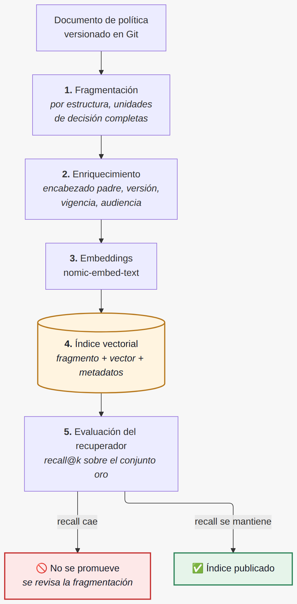
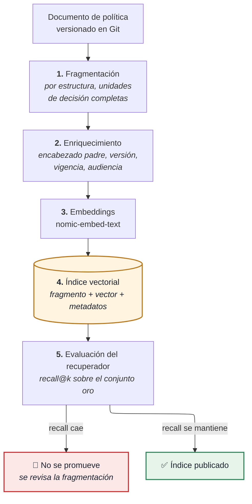
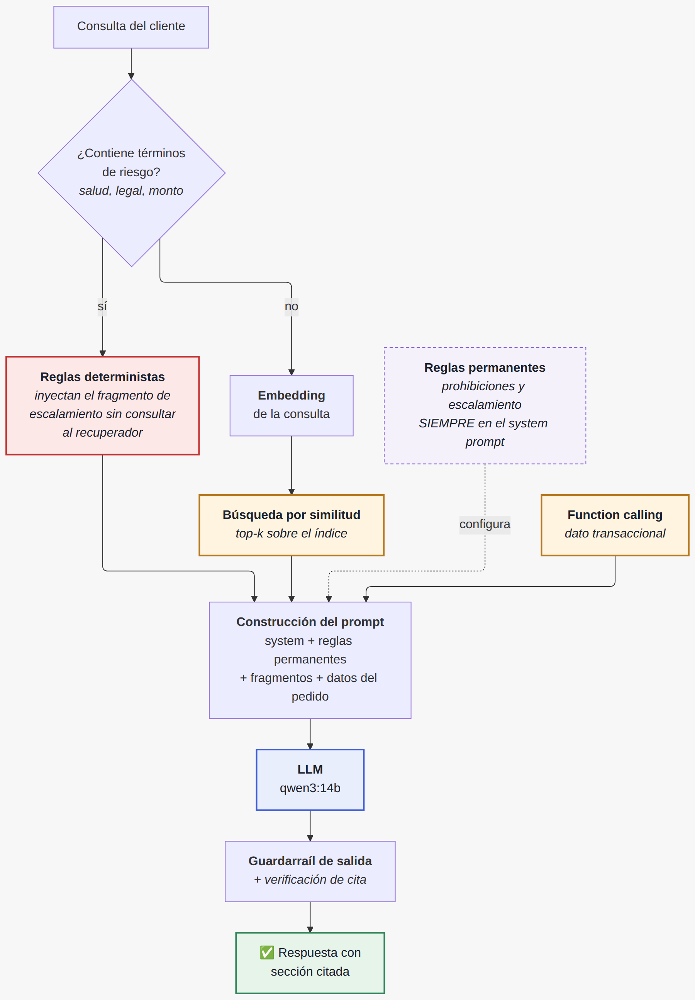
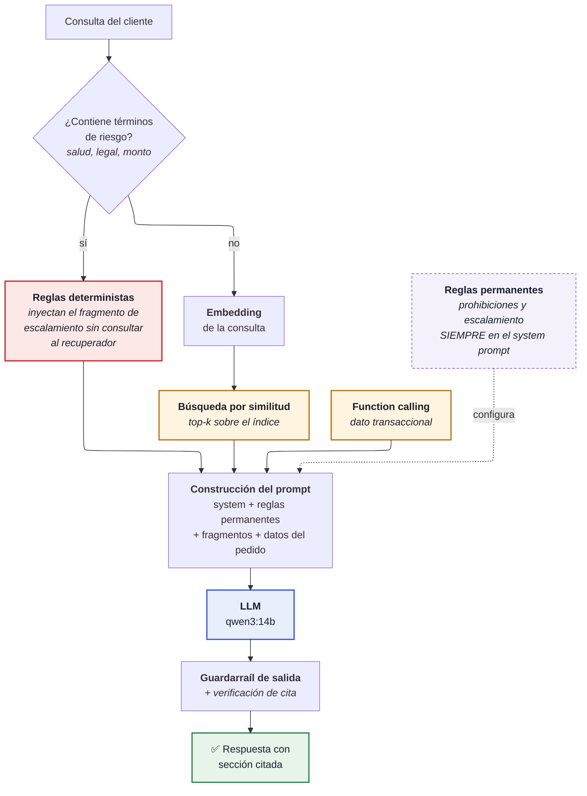

# Fase 4 — Viabilidad de RAG, datos, herramientas y flujos

**Caso**: EcoMarket — optimización de la atención al cliente
**Autor**: José Luis Realpe M.
**Curso**: Inteligencia Artificial Generativa — Maestría en IA Aplicada, Universidad Icesi

> Esta fase responde las dos preguntas planteadas en la segunda sesión: si RAG encaja realmente en
> la solución y qué valor añadido aportaría, y qué datos, herramientas y flujos exige una
> implementación básica.
>
> A diferencia de las fases anteriores, aquí las afirmaciones se apoyan en un **prototipo ejecutable**
> ([`fase4_rag/`](fase4_rag/)) y en su medición, no solo en el razonamiento.

---

## 1. ¿Encaja RAG en este caso?

**Sí, para una parte del problema, y esa delimitación es la respuesta completa.**

La Fase 1 estableció que cada tipo de información entra por un camino distinto. RAG es el camino de
uno solo de ellos:

| Tipo de información | Ejemplo | ¿RAG? | Por qué |
| :--- | :--- | :---: | :--- |
| Normativa semi-estática | Política de devoluciones, plazos, FAQ, fichas de producto | **Sí** | Cambia cada mes, es texto, y la respuesta correcta está escrita en alguna parte del corpus |
| Transaccional volátil | Estado del pedido, guía, fecha estimada | **No** | Cambia cada hora. Indexar un estado de pedido produce respuestas correctas el día que se indexó. Va por *function calling* |
| Estilo y conducta | Tono, formato, prohibiciones | **No** | Es configuración, va en el system prompt y se versiona en Git |
| Juicio y excepción | Conceder un reembolso fuera de plazo | **No** | Es una decisión con consecuencia económica. Va al carril copiloto con aprobación humana |

Un error frecuente es indexarlo todo porque el mecanismo funciona con cualquier texto. Aplicado al
estado de un pedido, RAG se convierte en una caché desactualizada con apariencia de búsqueda
inteligente.

---

## 2. Qué valor aporta, en concreto

**Actualizar la norma sin tocar el modelo.** Si mañana el plazo de devolución pasa de 30 a 45 días,
alguien edita el documento y se reindexa. Sin reentrenamiento, sin despliegue de un modelo nuevo,
sin ventana de mantenimiento.

**Trazabilidad ante un reclamo.** La respuesta puede citar la sección de la que salió. En la prueba,
la respuesta correcta cerró con "Sección 1.3". Ante un reclamo se reconstruye qué decía esa versión
del documento el día de la consulta, lo cual conecta con el registro de auditoría de la Fase 1.

**Reducción de la alucinación normativa.** El defecto más grave de la Fase 3 fue que el modelo
inventó una condición ("los perecederos no se devuelven una vez abiertos"). Con el fragmento correcto
delante y la instrucción de ceñirse a él, esa fabricación tiene menos espacio.

**Control de acceso por documento.** Un corpus indexado permite decidir qué fragmentos ve el
asistente público y cuáles solo el agente humano. Un modelo afinado con esa información no lo permite:
lo que quedó en los pesos ya no se puede segmentar por audiencia.

**Un corpus, varios consumidores.** El mismo índice sirve al asistente de clientes, al buscador
interno de los agentes y a la base de conocimiento del equipo.

---

## 3. Qué NO resuelve RAG

Esta sección importa tanto como la anterior, porque el riesgo real de RAG es la confianza excesiva.

**No corrige un corpus equivocado.** Si la política está mal redactada o desactualizada, RAG la
recupera con precisión y la propaga a escala. Amplifica el corpus, sea bueno o malo.

**No garantiza que el modelo use lo recuperado.** Recuperar el fragmento correcto es condición
necesaria, no suficiente: el modelo todavía puede ignorarlo, resumirlo mal o agregarle una condición
inventada, como quedó documentado en la Fase 3.

**No resuelve el dato transaccional**, por lo dicho en la sección 1.

**No aporta juicio.** Recupera la norma aplicable; decidir una excepción a esa norma sigue siendo del
agente humano.

**No es gratis en latencia.** Cada consulta suma una llamada de *embedding* y una búsqueda antes de
la generación.

---

## 4. La evidencia: el experimento de fragmentación

### 4.1 Hipótesis

El corpus de EcoMarket tiene una restricción (sección 1.2: los perecederos no admiten devolución) y
su excepción en la sección siguiente (1.3: la restricción no aplica si el producto llegó dañado).

**Hipótesis**: si la fragmentación separa la regla de su excepción, el sistema negará una devolución
que sí procede, sin que ni el modelo ni el prompt tengan defecto alguno.

### 4.2 Diseño

Se indexó el mismo corpus con dos estrategias y se midió el recuperador **aislado del generador**:

| Estrategia | Descripción | Fragmentos | ¿1.2 y 1.3 juntos? |
| :--- | :--- | ---: | :--- |
| `fija` | Ventana deslizante de 450 caracteres con 80 de solape. Ignora la estructura del documento | 11 | **No** — quedan en `fijo-02` y `fijo-03` |
| `seccion` | Respeta encabezados, arrastra el encabezado padre y mantiene unidas las secciones que forman una unidad de decisión | 8 | **Sí** — ambas en `sec-02` |

La diferencia entre ambas cabe en unas pocas líneas. La estrategia `seccion` declara qué subsecciones
forman una unidad de decisión y las indexa juntas ([`fase4_rag/rag.py`](fase4_rag/rag.py)):

```python
# Unidades de decision que deben permanecer juntas, por prefijo de encabezado
INSEPARABLES = [("### 1.2", "### 1.3")]
...
for ini, fin in INSEPARABLES:
    if sub.startswith(ini) and subbloques[i + 1].startswith(fin):
        fusionar = True          # 1.2 (restriccion) + 1.3 (excepcion) -> un solo fragmento
```

Esa lista es el punto del experimento: **no se puede deducir del documento por medios automáticos**.
Alguien tiene que leer la política y reconocer que la sección 1.3 modifica a la 1.2. Es criterio humano
sobre el dominio, expresado como configuración.

Se evalúa el recuperador por separado porque **un fragmento que no se recupera no lo compensa ningún
prompt**. Medir solo la respuesta final mezcla dos fallos distintos y lleva a ajustar el prompt cuando
el problema estaba en el índice.

Métrica: *recall@k* sobre un conjunto de 8 preguntas con respuesta conocida, 3 de ellas marcadas como
**críticas** —aquellas cuyo fallo produce una respuesta con consecuencia real: negar una devolución
que procede, atender automáticamente un caso de salud, u ofrecer una compensación no autorizada.

### 4.3 Cómo reproducir el experimento

Requisitos: Python 3.10+, [Ollama](https://ollama.com), y `requests` como única dependencia.

```bash
# 1. Modelos (el de embeddings pesa ~300 MB; el LLM ya se usa en la Fase 3)
ollama pull nomic-embed-text
ollama pull qwen3:14b

# 2. Entorno
cd taller1-iagen
python3 -m venv .venv && source .venv/bin/activate
pip install -r requirements.txt

# 3. Construir los dos índices (uno por estrategia)
cd fase4_rag
python rag.py --indexar

# 4. Medir el recuperador
python evaluar.py --k 3
python evaluar.py --k 1
```

Salida esperada del paso 4:

```
Evaluando con k=3 sobre 8 preguntas

  seccion   recall@3 = 7/8  (críticos 2/3)
  fija      recall@3 = 5/8  (críticos 1/3)

Informe guardado en outputs/evaluacion_retriever_k3.md
```

Para reproducir la demostración de punta a punta de la sección 4.5:

```bash
P="Compre un mix de frutos secos y llego con el empaque roto, puedo devolverlo?"
python rag.py --preguntar "$P" --estrategia fija    --k 1
python rag.py --preguntar "$P" --estrategia seccion --k 1
```

Y para inspeccionar qué se recuperó sin gastar una llamada al LLM:

```bash
python rag.py --preguntar "$P" --estrategia fija --k 1 --solo-recuperar
```

Los índices se escriben en `fase4_rag/indices/` y están excluidos del repositorio: son derivados y se
regeneran con el paso 3. Los informes de `outputs/` sí se versionan, porque son la evidencia.

**Sobre la reproducibilidad exacta**: los *embeddings* son deterministas, de modo que el ranking de
fragmentos se repite entre ejecuciones. La respuesta del LLM en la sección 4.5 puede variar en redacción
—temperatura 0.2 reduce la variación sin eliminarla—, aunque el sentido de la respuesta lo determina el
fragmento recuperado, que sí es estable.

### 4.4 Resultados

| Estrategia | recall@3 | Críticos @3 | recall@1 | Críticos @1 |
| :--- | :---: | :---: | :---: | :---: |
| **`seccion`** | **7/8** | **2/3** | **4/8** | **1/3** |
| `fija` | 5/8 | 1/3 | 3/8 | 0/3 |

La fragmentación consciente de la estructura gana en las cuatro medidas. El detalle por pregunta está
en [`fase4_rag/outputs/`](fase4_rag/outputs/).

### 4.5 La demostración de punta a punta

Misma pregunta, mismo modelo (`qwen3:14b`), mismo prompt, mismo `k=1`. Lo único que cambia es la
estrategia de fragmentación:

> *"Compré un mix de frutos secos y llegó con el empaque roto, ¿puedo devolverlo?"*

**Con `fija`** (recupera `fijo-02`, puntaje 0.631):

> "No, los productos perecederos o con fecha de vencimiento no se aceptan para devolución, incluso si
> el empaque está roto."

**Con `seccion`** (recupera `sec-02`, puntaje 0.631):

> "Sí, puede devolverlo. Según la sección 1.3, si el producto llegó dañado se aplica la excepción para
> reposición o reembolso total, incluso para categorías como PERECEDERO. Debe reportarlo dentro de las
> 72 horas siguientes a la entrega y adjuntar evidencia fotográfica."

La primera respuesta niega un derecho que el cliente tiene. **El modelo no se equivocó: respondió
correctamente con el fragmento incompleto que se le entregó.**

**El detalle más revelador es el puntaje: 0.631 en ambos casos.** El recuperador estaba exactamente
igual de seguro cuando acertó y cuando falló. La similitud del coseno mide parecido temático y no
suficiencia: no informa si el fragmento contiene lo necesario para responder. **Un umbral de similitud
no sirve como control de calidad de la recuperación.**

### 4.6 Conclusión del experimento

La fragmentación no es un parámetro técnico que se ajusta por tamaño: **es una decisión sobre lógica
de negocio**. Separar una regla de su excepción produce un sistema que aplica media norma, y ese error
es invisible para el modelo, para el prompt y para el puntaje de similitud.

De ahí que la fragmentación deba diseñarse leyendo el documento y preguntando qué partes forman una
unidad de decisión, lo cual exige criterio humano sobre el dominio y no solo una elección de
`chunk_size`.

---

## 5. El hallazgo que no se buscaba: las reglas de seguridad no se recuperan

Al revisar **qué** preguntas fallan, aparece un patrón que cruza ambas estrategias:

| Pregunta | `seccion` @3 | `fija` @3 | `seccion` @1 | `fija` @1 |
| :--- | :---: | :---: | :---: | :---: |
| Descuento por la demora *(prohibición)* | **falla** | ok | **falla** | **falla** |
| Reacción alérgica *(escalamiento)* | ok | **falla** | **falla** | **falla** |
| Perecedero dañado *(excepción)* | ok | **falla** | ok | **falla** |

Las dos primeras son reglas de seguridad, y son las que peor se recuperan. La razón es estructural:

> **Una prohibición no se parece semánticamente a la petición que debe bloquear.**

"¿Me pueden dar un descuento por la demora?" y "Prohibido ofrecer compensaciones, cupones o descuentos
por iniciativa propia" expresan intenciones opuestas, y por eso quedan lejos en el espacio de
*embeddings*. Lo mismo ocurre con los criterios de escalamiento: el cliente describe un síntoma y la
norma habla de "casos que no puede resolver el asistente automático".

**Los fragmentos que el sistema más necesita para no cometer un error grave son justamente los que la
búsqueda por similitud peor recupera.**

### 5.1 Consecuencia de diseño

Las reglas de seguridad **no deben depender del recuperador**. Tienen que estar presentes siempre:

1. **En el system prompt**, como reglas permanentes: la prohibición de ofrecer compensaciones y los
   criterios de escalamiento son cortos y no cambian a diario.
2. **Adjuntadas por reglas deterministas**: si el mensaje contiene términos de salud, alergia,
   intoxicación o acción legal, el fragmento de escalamiento se inyecta sin consultar al recuperador.
3. **RAG queda para la norma consultiva**: plazos, categorías, procedimientos. Lo que responde
   preguntas, no lo que impone límites.

Esta conclusión coincide con la de la Fase 2, sección 3.6, a la que se llegó por un camino distinto:
allí se propuso aplicar reglas duras antes del clasificador semántico. **Dos experimentos
independientes convergen en que lo crítico no se delega a un componente probabilístico.**

---

## 6. Datos necesarios

| Dato | Fuente | Frecuencia de cambio | Sensibilidad | Mecanismo |
| :--- | :--- | :--- | :--- | :--- |
| Políticas de devolución y envío | Documento versionado | Mensual | Pública | **RAG** |
| FAQ de atención | Base de conocimiento | Semanal | Pública | **RAG** |
| Fichas de producto | Catálogo | Semanal | Pública | **RAG** |
| Estado del pedido, guía, fechas | BD transaccional | Minutos | **PII** | Function calling |
| Datos del cliente | BD transaccional | Variable | **PII** | Function calling, minimizado |
| Canales oficiales de contacto | Configuración | Rara | Pública | Lista blanca en el validador |
| Histórico de conversaciones | Logs | Continua | **PII** | **Fuera del índice** |

Dos decisiones explícitas sobre este inventario:

**Ninguna PII entra al índice vectorial.** Un *embedding* no es reversible de forma trivial, pero
tampoco es anónimo, y un índice no ofrece el borrado selectivo que exige el derecho de supresión de la
Ley 1581 de 2012. El dato personal se consulta en la fuente y se inyecta en el momento, sin
persistirse en el índice.

**El histórico de conversaciones queda fuera.** Es tentador indexarlo como base de casos resueltos,
pero contiene PII y respuestas de calidad desigual: indexar un error pasado lo convierte en doctrina.

---

## 7. Herramientas y por qué

| Componente | Elección en el prototipo | Elección en producción | Justificación |
| :--- | :--- | :--- | :--- |
| Modelo de *embeddings* | `nomic-embed-text` (Ollama) | `bge-m3` o equivalente multilingüe | Local, sin costo por llamada, sin salida de datos |
| Almacén vectorial | **Ninguno**: similitud coseno en Python | **Oracle 23ai** con tipo `VECTOR`, o pgvector | Ver abajo |
| LLM | `qwen3:14b` (Ollama) | El mismo, replicado | Decisión de la Fase 1, verificada en la 3 |
| Orquestación | ~200 líneas de Python | El mismo enfoque | Ver abajo |
| Corpus | Markdown versionado en Git | El mismo | El diff de una política es auditable |

### 7.1 Por qué el prototipo no usa una base vectorial

El corpus son 8 fragmentos. A ese volumen, una búsqueda exhaustiva por coseno es instantánea y exacta,
mientras que un motor vectorial aporta un índice aproximado que resuelve un problema que aquí no
existe, a cambio de una dependencia más.

**El umbral práctico** para migrar está en el orden de los **10.000 fragmentos** o cuando la latencia
de búsqueda pase de unos pocos milisegundos. Por debajo de eso, el motor vectorial es infraestructura
que hay que operar sin ganancia medible.

### 7.2 Por qué Oracle 23ai en producción

En el caso de EcoMarket la BD transaccional ya existe y el equipo la opera. El tipo `VECTOR` nativo de
Oracle 23ai permite guardar los *embeddings* junto al resto del dato corporativo, con tres ventajas
sobre una base vectorial aparte: un solo respaldo y una sola estrategia de recuperación, el control de
acceso por roles que ya está definido, y la posibilidad de combinar filtro relacional con búsqueda
semántica en una sola consulta —por ejemplo, restringir la búsqueda a las políticas vigentes a una
fecha—. Menos piezas que operar suele pesar más que unos milisegundos de diferencia.

### 7.3 Por qué no un framework de orquestación

LangChain o LlamaIndex resuelven en tres líneas lo que aquí toma doscientas, y para un prototipo cuyo
objetivo es **entender el mecanismo** eso es una desventaja: el fallo de fragmentación que descubrió
este experimento habría quedado oculto detrás de un `TextSplitter` por defecto. En producción, con
varios tipos de documento y reindexación programada, un framework se justifica.

---

## 8. Flujos

### 8.1 Ingesta (fuera de línea, al cambiar el corpus)

<p align="center">
  
</p>

<details>
<summary><b>Ver el código fuente del diagrama (Mermaid)</b></summary>



</details>

El paso 5 es el que convierte esto en un proceso operable: **reindexar sin medir es desplegar a
ciegas**, porque un cambio de fragmentación puede degradar la recuperación sin que nada falle de forma
visible. Es la misma disciplina de un conjunto de pruebas de regresión antes de un despliegue.

### 8.2 Consulta (en línea, por cada mensaje)

<p align="center">
  
</p>

<details>
<summary><b>Ver el código fuente del diagrama (Mermaid)</b></summary>



</details>

Las dos cajas rojas y moradas son la consecuencia directa del hallazgo de la sección 5: lo crítico
entra por un camino determinista y no por el recuperador.

---

## 9. Parámetros iniciales y cómo se ajustan

| Parámetro | Valor inicial | Criterio de ajuste |
| :--- | :--- | :--- |
| Estrategia de fragmentación | Por estructura, unidades de decisión completas | Medido: 7/8 contra 5/8 de la ventana fija |
| Tamaño de fragmento | El de la sección natural (200–1100 caracteres) | Si una sección excede el contexto útil, se parte por subsección sin separar regla y excepción |
| `k` | **3** | Con k=1 el recall cae de 7/8 a 4/8 incluso con buena fragmentación |
| Umbral de similitud | **No se usa** | El experimento mostró puntaje idéntico en un acierto y un fallo |
| Temperatura | 0.2 | Tarea factual |

La fila del umbral es la más contraintuitiva y la más sustentada: **descartar fragmentos por debajo de
un puntaje no protege de nada**, porque el puntaje no distingue un fragmento suficiente de uno
incompleto.

Sobre `k`: subirlo mejora el recall y mete más texto irrelevante en el prompt, que fue el origen del
defecto 2 de la Fase 3 —el modelo aplicó una regla que estaba en el contexto pero no correspondía al
caso—. Entre 3 y 5 hay un equilibrio que debe medirse, no suponerse.

---

## 10. Cómo se evalúa

| Métrica | Qué mide | Meta |
| :--- | :--- | :--- |
| **recall@k** | El contenido necesario está entre los k fragmentos | ≥ 90 % |
| **Recuperación de casos críticos** | Los fragmentos de seguridad llegan cuando deben | **100 %**, tratado como bloqueante |
| Tasa de cita correcta | La sección citada es la que sustenta la respuesta | ≥ 95 % |
| Cobertura del corpus | Fragmentos que nunca se recuperan | Revisión trimestral |
| Latencia añadida | *Embedding* + búsqueda | < 500 ms |

El conjunto oro de preguntas es un activo del proyecto y debe crecer con cada fallo real detectado en
producción, igual que un conjunto de pruebas de regresión.

La última fila merece atención: un fragmento que **nunca** se recupera está señalando que el corpus
tiene contenido muerto, que la redacción no coincide con la forma en que preguntan los clientes, o que
la fragmentación lo dejó inservible.

---

## 11. Riesgos que RAG introduce

Riesgos nuevos, adicionales a los de la Fase 2:

**Envenenamiento del corpus.** Quien pueda editar el documento de políticas modifica el comportamiento
del asistente sin tocar una línea de código. El corpus necesita el mismo control de cambios que el
código: revisión por pares, versionado y registro de quién aprobó.

**Fuga por control de acceso.** Si el índice mezcla documentos internos con públicos, una consulta bien
formulada puede extraer contenido que no era para el cliente. Los metadatos de audiencia deben filtrar
**antes** de la búsqueda.

**Deriva silenciosa del índice.** El documento se actualiza y el índice no. El sistema responde con
seguridad la política del mes pasado. Mitigación: reindexación disparada por el commit y verificación
de que la versión indexada coincide con la vigente.

**Falsa sensación de fundamento.** Que una respuesta cite una sección la hace parecer verificada. Si el
fragmento citado estaba incompleto —el caso de la sección 4.5—, la cita respalda una respuesta
incorrecta y la vuelve más creíble.

**Corpus redactado para el sistema y no para el cliente.** La Fase 3 lo detectó por accidente: los
códigos `DURADERO` y `PERECEDERO` aparecieron en respuestas al cliente porque están escritos así en la
tabla de políticas. Todo fragmento es texto que puede llegar literalmente al cliente.

---

## 12. Alcance de una implementación básica

Lo construido en [`fase4_rag/`](fase4_rag/) es el alcance mínimo viable y cabe en un equipo personal:

- `rag.py` — fragmentación con dos estrategias, *embeddings*, búsqueda por coseno y generación.
- `evaluar.py` — conjunto oro de 8 preguntas y medición de *recall@k* por estrategia.
- Sin dependencias más allá de `requests`. Todo local, sin costo por llamada y sin que ningún dato
  salga del equipo.

**Lo siguiente, en orden de valor:**

1. Mover las reglas de seguridad al system prompt y a filtros deterministas (sección 5.1). Es el
   cambio de mayor impacto y el más barato.
2. Reescribir `politicas.md` para el lector final, quitando los códigos internos del texto recuperable.
3. Ampliar el conjunto oro a 30–50 preguntas tomadas de consultas reales.
4. Añadir metadatos de vigencia y audiencia a cada fragmento.
5. Migrar a Oracle 23ai cuando el corpus crezca o se necesite filtrar por atributos antes de buscar.

---

## 13. Conclusión de la fase

**RAG encaja en la solución de EcoMarket para el corpus normativo, y solo para él.** Aporta
actualización sin reentrenamiento, trazabilidad ante un reclamo y menor alucinación normativa. No
resuelve el dato transaccional, no corrige un corpus equivocado y no garantiza que el modelo use lo
que se le entrega.

El prototipo permitió medir en lugar de suponer, y dejó dos conclusiones que no estaban en el plan.

La primera: **la fragmentación es una decisión de negocio disfrazada de parámetro técnico.** Separar
una regla de su excepción produjo que el mismo modelo, con el mismo prompt, negara una devolución
legítima. Y el puntaje de similitud fue idéntico en el acierto y en el fallo, de modo que el propio
sistema no tenía cómo notarlo.

La segunda: **los fragmentos de seguridad son los que peor recupera una búsqueda semántica**, porque
una prohibición no se parece a la petición que debe bloquear. Lo crítico no puede depender de un
componente probabilístico, que es exactamente la conclusión a la que llegó la Fase 2 por otro camino.

Ambas refuerzan la tesis del trabajo: la garantía proviene de la arquitectura que rodea al modelo, y
cada pieza de esa arquitectura —el dato, el prompt, el control de salida, el corpus y ahora también la
fragmentación y el recuperador— tiene un alcance que conviene medir antes de confiar en ella.
